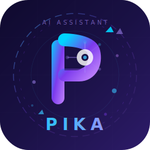

  

  # 🎙️ Pika AI — Desktop Assistant

  **A sleek, modern, voice-controlled Desktop Assistant built with Next.js & Python**

  Control your PC • Offline Hindi/English Voice Recognition • Chat with top LLMs

  
  
  
  
  
  

---

## 📖 Table of Contents

- [🌟 Features](#-features)
- [📸 Screenshots](#-screenshots)
- [🚀 Quick Start Guide](#-quick-start-guide)
- [⚙️ Configuration](#%EF%B8%8F-configuration)
- [💻 PC Bridge Capabilities](#-pc-bridge-capabilities)
- [🤖 AI Providers Comparison](#-ai-providers-comparison)
- [🛠️ Tech Stack](#%EF%B8%8F-tech-stack)
- [📁 Project Structure](#-project-structure)
- [🔧 Troubleshooting](#-troubleshooting)
- [🗺️ Roadmap](#%EF%B8%8F-roadmap)
- [🤝 Contributing](#-contributing)
- [📄 License](#-license)
- [👤 Author](#-author)

---

## 🌟 Features

| Feature | Description |
|---------|-------------|
| 🎤 **Offline Voice Recognition** | Vosk-based Hindi & English speech-to-text — works without internet |
| 💬 **AI Chat** | Chat with Groq, Google Gemini, Mistral, or Cerebras LLMs |
| 💻 **PC Control** | Volume, Apps, Shutdown, Media, Screenshot — all from your browser |
| 🔔 **Smart Reminders** | Set timers with desktop notifications |
| 📋 **Clipboard Manager** | Track & reuse your copy history |
| 📊 **System Monitor** | Real-time CPU, RAM, Battery, Disk usage |
| 📱 **Cross-Device** | Access from your phone on the same WiFi |
| 🎨 **Glassmorphism UI** | Premium dark-mode interface with animations |
| ⚡ **One-Click Start** | Double-click `start.bat` — frontend + backend start together |
| 🔄 **Auto Fallback** | If one AI provider fails, switches to another automatically |
| 🌐 **Web Search** | Google, YouTube, GitHub, StackOverflow search from UI |
| 🪟 **Window Control** | Minimize, Maximize, Close, Switch windows remotely |
| 🔆 **Brightness Control** | Adjust screen brightness from the UI |
| 📶 **WiFi Manager** | List, connect, disconnect WiFi networks |
| ⌨️ **Keyboard Shortcuts** | Send any hotkey remotely (Ctrl+C, Alt+Tab, etc.) |
| 📁 **File Manager** | Create, delete, list files and folders |

---

## 📸 Screenshots

> 💡 **Add your screenshots here!** Take screenshots of your app and place them in the `screenshots/` folder.

| Chat Interface | PC Control Panel |
|:-:|:-:|
|  |  |
| **Settings Page** | **System Monitor** |
|  |  |

---

## 🚀 Quick Start Guide

### 📋 Requirements

| Software | Version | Download |
|----------|---------|----------|
| **Node.js** | v18+ | [nodejs.org](https://nodejs.org/) |
| **Python** | v3.10+ | [python.org](https://www.python.org/) |
| **npm** | (comes with Node) | — |
| **pip** | (comes with Python) | — |
| **Browser** | Chrome / Edge / Firefox | Any modern browser |

### 🔑 API Key (Any ONE)

| Provider | Link | Free? | Speed |
|----------|------|-------|-------|
| **Groq** ⭐ Recommended | [console.groq.com](https://console.groq.com) | ✅ Yes | ⚡⚡⚡ Ultra Fast |
| **Google Gemini** | [aistudio.google.com](https://aistudio.google.com) | ✅ Yes | ⚡⚡ Fast |
| **Mistral** | [console.mistral.ai](https://console.mistral.ai) | ✅ Yes | ⚡⚡ Fast |
| **Cerebras** | [cloud.cerebras.ai](https://cloud.cerebras.ai) | ✅ Yes | ⚡⚡⚡ Ultra Fast |

### 📥 Installation

\`\`\`bash
# 1. Clone the repository
git clone https://github.com/SudhirDevOps1/Ai-assistant-pika.git
cd Ai-assistant-pika

# 2. Install frontend dependencies
npm install

# 3. Install Python dependencies for PC Bridge
cd pc-bridge
pip install -r requirements.txt
cd ..
\`\`\`

### ▶️ Running the Assistant

**Option 1 — One Click (Recommended):**
Just double-click the **\`start.bat\`** file in the root folder.

This will automatically:
1. Start the Next.js Web UI on \`http://localhost:3000\`
2. Start the Python PC Bridge on \`ws://localhost:8765\`

**Option 2 — Manual (Two Terminals):**

\`\`\`bash
# Terminal 1 — Web UI
npm run dev

# Terminal 2 — PC Bridge
cd pc-bridge
python pc_bridge.py
\`\`\`

Then open **http://localhost:3000** in your browser.

### 📱 Phone Access

Connect your phone to the **same WiFi** as your PC, then open:

\`\`\`
http://YOUR_PC_IP:3000
\`\`\`

Find your PC IP by running \`ipconfig\` in terminal.

---

## ⚙️ Configuration

1. Open [http://localhost:3000](http://localhost:3000) in your browser
2. Go to **Settings** ⚙️ in the sidebar
3. **Select Provider** — choose Groq/Gemini/Mistral/Cerebras
4. **Paste API Key** — in the provider's API key field
5. **PC Bridge URL** — set to \`ws://localhost:8765\`
6. Click **Save Settings** ✅
7. Start chatting or use voice commands!

### 🔊 Voice Settings

| Setting | Default | Description |
|---------|---------|-------------|
| **TTS Voice** | en-US-Neural2-A | Text-to-speech voice |
| **Wake Word** | Hey Assistant | Word to activate voice mode |
| **History Limit** | 50 | Messages to remember |
| **Auto Fallback** | Enabled | Auto-switch provider on failure |

---

## 💻 PC Bridge Capabilities

The Python Bridge (\`pc_bridge.py\`) runs on your PC and accepts WebSocket commands from the Web UI.

### Architecture

\`\`\`
┌─────────────┐     WebSocket      ┌─────────────────┐     ┌──────────────┐
│   Web UI    │◄──────────────────►│  Python Bridge   │────►│   PC Actions │
│  (Browser)  │  ws://localhost:    │  (pc_bridge.py)  │     │              │
│  :3000      │      8765          │  :8765           │     │  Volume,Apps │
└─────────────┘                    └─────────────────┘     │  Shutdown,etc│
                                                            └──────────────┘
\`\`\`

### Features (16 Categories)

| Category | Commands |
|----------|----------|
| ⚡ **System** | Shutdown, Restart, Sleep, Lock, Log Off |
| 🔊 **Volume** | Up, Down, Mute, Unmute, Set Level |
| 🎵 **Media** | Play/Pause, Next Track, Previous Track |
| 📱 **Apps** | Open/Close Chrome, VS Code, Notepad, Calculator, 25+ apps |
| 🌐 **URL** | Open any URL in browser |
| 🪟 **Windows** | Minimize, Maximize, Close, Switch, Show Desktop |
| 📊 **System Info** | CPU, RAM, Disk, Battery, IP, Uptime |
| 📋 **Clipboard** | Get, Set, Paste clipboard content |
| 📁 **Files** | Create, Delete, List files and directories |
| 📸 **Screenshot** | Take screenshot, save to desktop |
| ⏰ **Reminders** | Set timed reminders with notifications |
| 🔔 **Notifications** | Send custom Windows notifications |
| ⌨️ **Keyboard** | Send any keyboard shortcut remotely |
| 🔆 **Brightness** | Get/set screen brightness |
| 📶 **WiFi** | List networks, Connect, Disconnect |
| 🔍 **Search** | Google, YouTube, GitHub, StackOverflow, Wikipedia |

---

## 🤖 AI Providers Comparison

| Provider | Best Models | Speed | Free? | Best For |
|----------|-------------|-------|-------|----------|
| 🟠 **Groq** | Llama 3.3 70B, Llama 4 Scout, DeepSeek R1 | ⚡⚡⚡ Ultra | ✅ Yes | General use, fast replies |
| 🔵 **Gemini** | Gemini 2.0 Flash, 2.5 Flash, 1.5 Pro | ⚡⚡ Fast | ✅ Yes | Complex reasoning, coding |
| 🟢 **Mistral** | Mistral Large, Codestral, Mixtral 8x7B | ⚡⚡ Fast | ✅ Yes | Coding, multilingual |
| 🟣 **Cerebras** | Llama 4 Scout, Llama 3.3 70B, Qwen 3 32B | ⚡⚡⚡ Ultra | ✅ Yes | Speed, batch processing |

> 🏆 **Recommendation:** Beginners ke liye **Groq + Llama 3.3 70B** best hai — free, fast, aur smart!

---

## 🛠️ Tech Stack

### Frontend
| Technology | Purpose |
|------------|---------|
| **Next.js 15** | React framework with App Router |
| **React 19** | UI library |
| **Tailwind CSS 3** | Utility-first styling |
| **Framer Motion** | Animations & transitions |
| **Lucide React** | Icons |

### Backend Bridge
| Technology | Purpose |
|------------|---------|
| **Python 3.10+** | Bridge server runtime |
| **WebSockets** | Real-time communication |
| **PyAutoGUI** | Keyboard & mouse automation |
| **Psutil** | System monitoring |
| **Pyperclip** | Clipboard access |
| **Pillow** | Screenshot capture |
| **PyGetWindow** | Window management |

### Voice
| Technology | Purpose |
|------------|---------|
| **Vosk** | Offline speech-to-text (Hindi + English) |
| **Web Speech API** | Online TTS (Text-to-Speech) |

### AI Models (via APIs)
| Model | Provider |
|-------|----------|
| Llama 3.3 70B | Groq, Cerebras |
| Llama 4 Scout | Groq, Cerebras |
| DeepSeek R1 | Groq |
| Gemini 2.0 Flash | Google |
| Mistral Large | Mistral |
| Codestral | Mistral |
| Mixtral 8x7B | Mistral |
| Qwen 3 32B | Cerebras |

---

## 📁 Project Structure

\`\`\`
Ai-assistant-pika/
│
├── 📄 start.bat                 # One-click startup (Windows)
├── 📄 start.sh                  # One-click startup (Linux/Mac)
├── 📄 index.html                # Offline setup guide (Hindi/English)
├── 📄 package.json              # Node.js dependencies
├── 📄 next.config.js            # Next.js configuration
├── 📄 tailwind.config.js        # Tailwind CSS configuration
├── 📄 .env.example              # Environment variables template
├── 📄 README.md                 # This file
├── 📄 LICENSE                   # MIT License
│
├── 📁 public/
│   ├── logo.svg                 # App logo
│   └── screenshots/             # UI screenshots
│
├── 📁 src/
│   ├── 📁 app/
│   │   ├── page.tsx             # Main page
│   │   ├── layout.tsx           # Root layout
│   │   └── globals.css          # Global styles
│   │
│   ├── 📁 components/
│   │   ├── ChatPanel.tsx        # AI Chat interface
│   │   ├── PCControlPanel.tsx   # PC Control buttons
│   │   ├── SettingsPanel.tsx    # Settings page
│   │   ├── Sidebar.tsx          # Navigation sidebar
│   │   ├── SystemMonitor.tsx    # System info display
│   │   ├── ClipboardPanel.tsx   # Clipboard history
│   │   ├── ReminderPanel.tsx    # Reminders manager
│   │   └── Header.tsx           # Top header bar
│   │
│   └── 📁 lib/
│       ├── ai-providers.ts      # AI API integrations
│       ├── voice.ts             # Voice recognition logic
│       └── websocket.ts         # WebSocket client
│
└── 📁 pc-bridge/
    ├── 📄 pc_bridge.py          # Python WebSocket server
    └── 📄 requirements.txt      # Python dependencies
\`\`\`

---

## 🔧 Troubleshooting

### ❌ "No API key configured"
**Fix:** Settings → Paste your API Key → Save Settings

Get key from: [console.groq.com](https://console.groq.com) (recommended)

### ❌ PC Control not working
**Fix:** Check these:
- ✅ Python bridge is running (\`python pc_bridge.py\`)
- ✅ Settings has \`ws://localhost:8765\`
- ✅ You clicked Save Settings
- ✅ Windows Firewall allows the app

### ❌ npm install fails
\`\`\`bash
rmdir /s /q node_modules
del package-lock.json
npm install
npm run dev
\`\`\`

### ❌ Port 3000 already in use
\`\`\`bash
npx kill-port 3000
npm run dev
\`\`\`

### ❌ Python bridge Unicode error
\`\`\`bash
chcp 65001
python pc_bridge.py
\`\`\`

### ❌ Volume/Media not working
\`\`\`bash
pip install pyautogui
\`\`\`

### ❌ Voice recognition not working
- Grant **microphone permission** to browser
- Use **Chrome or Edge** (best support)
- Must be on **HTTPS or localhost**

---

## 🗺️ Roadmap

### ✅ v0.2.0 (Current)
- [x] Multi-provider AI chat
- [x] PC Bridge with 16 control categories
- [x] Offline Vosk voice recognition
- [x] One-click start.bat
- [x] Glassmorphism UI
- [x] System monitor
- [x] Clipboard manager
- [x] Smart reminders

### 🔜 v0.3.0 (Planned)
- [ ] Electron desktop app packaging
- [ ] Docker support
- [ ] Custom wake word training
- [ ] Plugin system for custom commands
- [ ] Multi-language UI (Hindi/English toggle)
- [ ] Voice cloning / custom TTS voices

### 🔮 v1.0.0 (Future)
- [ ] Mobile app (React Native)
- [ ] Cloud sync for settings
- [ ] Team collaboration features
- [ ] AI agent with tool use
- [ ] Automation workflows (if-this-then-that)
- [ ] GitHub Actions CI/CD

---

## 🤝 Contributing

Contributions are welcome! Here's how:

1. **Fork** this repository
2. **Clone** your fork:
   \`\`\`bash
   git clone https://github.com/YOUR_USERNAME/Ai-assistant-pika.git
   \`\`\`
3. **Create** a branch:
   \`\`\`bash
   git checkout -b feature/amazing-feature
   \`\`\`
4. **Make** your changes
5. **Commit**:
   \`\`\`bash
   git commit -m "Add amazing feature"
   \`\`\`
6. **Push**:
   \`\`\`bash
   git push origin feature/amazing-feature
   \`\`\`
7. **Open** a Pull Request

### 💡 Ideas for Contributions
- 🌍 Add more language support for voice
- 🎨 New UI themes
- 🐍 New PC Bridge commands
- 📝 Documentation improvements
- 🐛 Bug fixes

---

## 📄 License

This project is licensed under the **MIT License** — see the [LICENSE](LICENSE) file for details.

\`\`\`
MIT License

Copyright (c) 2025 SudhirDevOps1

Permission is hereby granted, free of charge, to any person obtaining a copy
of this software and associated documentation files (the "Software"), to deal
in the Software without restriction, including without limitation the rights
to use, copy, modify, merge, publish, distribute, sublicense, and/or sell
copies of the Software, and to permit persons to whom the Software is
furnished to do so, subject to the following conditions:

The above copyright notice and this permission notice shall be included in all
copies or substantial portions of the Software.

THE SOFTWARE IS PROVIDED "AS IS", WITHOUT WARRANTY OF ANY KIND, EXPRESS OR
IMPLIED, INCLUDING BUT NOT LIMITED TO THE WARRANTIES OF MERCHANTABILITY,
FITNESS FOR A PARTICULAR PURPOSE AND NONINFRINGEMENT. IN NO EVENT SHALL THE
AUTHORS OR COPYRIGHT HOLDERS BE LIABLE FOR ANY CLAIM, DAMAGES OR OTHER
LIABILITY, WHETHER IN AN ACTION OF CONTRACT, TORT OR OTHERWISE, ARISING FROM,
OUT OF OR IN CONNECTION WITH THE SOFTWARE OR THE USE OR OTHER DEALINGS IN THE
SOFTWARE.
\`\`\`

---

## 👤 Author

**SudhirDevOps1**

---

**⭐ If you like this project, give it a star on GitHub! ⭐**

Made with ❤️ using Next.js 15 + React 19 + Python

